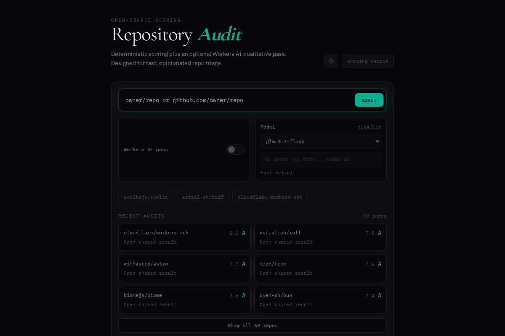

[](https://opensource.org/licenses/MIT)
[](https://www.typescriptlang.org/)
[](https://astro.build)
[](https://developers.cloudflare.com/workers-ai/)
[](https://repo-audit.coey.dev)

# Repo Audit

**Score any public GitHub repository across 11 quality categories — instantly, from the edge.**

Repo Audit is an open-source tool that analyzes GitHub repositories and produces a detailed quality scorecard. It combines deterministic heuristics (file presence, README analysis, community health) with an optional AI-powered qualitative pass via Cloudflare Workers AI. The result is a letter grade (S → F) with per-category breakdowns, strengths, weaknesses, and actionable recommendations.



## Features

- **11-category scoring matrix** — First Impressions, README Quality, Documentation, Code Quality, Testing, CI/CD, Security, Community, Project Health, Dev Experience, and Licensing
- **Deterministic + AI hybrid** — Base scores are computed from GitHub API data with reproducible heuristics; an optional Workers AI pass adds nuanced adjustments (±2 per category)
- **Edge-native** — Runs entirely on Cloudflare's edge network with sub-second response times
- **Rate limiting** — KV-backed per-IP rate limiting to manage API and AI costs
- **Result caching** — KV-backed result caching (10 min for AI, 1 hour for deterministic) reduces redundant GitHub API calls
- **Shareable results** — Permanent links at `/r/:id` with dynamically generated Open Graph images
- **Model selection** — Choose from any `@cf/` or `@hf/` model in the Workers AI catalog (default: `@cf/zai-org/glm-4.7-flash`)
- **Letter grading** — S (≥8.5, Exceptional), A (≥7.0, Production-Ready), B (≥5.5, Solid Foundation), C (≥4.0, Needs Work), D (≥2.0, Significant Gaps), F (<2.0, Critical Issues)
- **Scoring matrix page** — Full rubric transparency at [`/matrix`](https://repo-audit.coey.dev/matrix)

## Quick Start

### Prerequisites

- [Node.js](https://nodejs.org/) 18+
- npm (included with Node.js)
- A [Cloudflare account](https://dash.cloudflare.com/sign-up) (for Workers AI and deployment)

### Install and Run Locally

Local dev runs the UI and API but **without Workers AI** (no `AI` binding available outside Cloudflare):

```bash
git clone https://github.com/acoyfellow/repo-audit.git
cd repo-audit
npm install
npm run dev
```

Open [http://localhost:4321](http://localhost:4321) in your browser. You can audit any public repo — scores will be deterministic-only (no AI summary).

### Cloudflare Dev (Workers AI)

To get AI-enhanced results locally, use Wrangler's remote dev mode which proxies requests through Cloudflare's network:

```bash
# 1) Authenticate with Cloudflare (one-time)
npx wrangler whoami

# 2) Optional: raise GitHub API rate limits
#    Create a GitHub token with no scopes (public-only)
cp .dev.vars.example .dev.vars
# Edit .dev.vars and add your GITHUB_TOKEN

# 3) Run remote dev — this enables Workers AI + KV bindings
npm run dev:cf
```

Remote dev builds the Astro site and starts Wrangler in `--remote` mode, giving you access to the `AI` binding, `RATE_LIMIT` KV, and `RESULTS` KV.

## Usage Examples

Audit a repository from the web UI at [repo-audit.coey.dev](https://repo-audit.coey.dev), or call the API directly:

```bash
# Deterministic scoring only (no AI)
curl "https://repo-audit.coey.dev/api/audit?repo=astro-community/astro-embed&ai=0"

# With AI enhancement (default)
curl "https://repo-audit.coey.dev/api/audit?repo=withastro/astro"

# With a specific Workers AI model
curl "https://repo-audit.coey.dev/api/audit?repo=denoland/deno&model=@cf/meta/llama-3.1-8b-instruct"
```

## API Reference

### `GET /api/audit`

Scores a public GitHub repository.

| Parameter | Type   | Default                      | Description                              |
|-----------|--------|------------------------------|------------------------------------------|
| `repo`    | string | *(required)*                 | Repository in `owner/name` format        |
| `ai`      | string | `"1"`                        | Set to `"0"` to disable AI enhancement   |
| `model`   | string | `@cf/zai-org/glm-4.7-flash`  | Workers AI model ID (`@cf/...` or `@hf/...`) |

**Headers (optional):**

| Header           | Description                                      |
|------------------|--------------------------------------------------|
| `x-github-token` | GitHub PAT to raise rate limits (never stored)   |

**Response shape:**

```json
{
  "meta": {
    "full_name": "owner/repo",
    "description": "A short description",
    "stars": 1234,
    "forks": 56,
    "open_issues": 12,
    "language": "TypeScript",
    "license": "MIT",
    "homepage": "https://example.com",
    "created_year": 2023,
    "archived": false
  },
  "scores": {
    "firstImpressions": 7.5,
    "readme": 8.0,
    "documentation": 6.0,
    "codeQuality": 7.0,
    "testing": 5.5,
    "cicd": 4.0,
    "security": 3.5,
    "community": 6.5,
    "maintenance": 8.0,
    "dx": 7.0,
    "licensing": 9.0
  },
  "details": {
    "firstImpressions": ["Has description", "5 topics", "1234 stars, 56 forks"],
    "readme": ["Comprehensive length", "Has setup section", "Has badges"]
  },
  "summary": "AI-generated paragraph summary...",
  "topStrength": "Well-maintained with active contributors",
  "topWeakness": "Missing security policy",
  "recommendations": ["Add SECURITY.md", "Set up Dependabot", "Add E2E tests"],
  "redFlags": [],
  "modelUsed": "@cf/zai-org/glm-4.7-flash"
}
```

**Status codes:**

| Code | Meaning                                       |
|------|-----------------------------------------------|
| 200  | Success (check `x-repo-audit-cache` header)   |
| 400  | Invalid `repo` parameter                      |
| 404  | Repository not found on GitHub                |
| 429  | Rate limit exceeded (check `retry-after`)     |
| 500  | Internal error                                |

### `GET /api/gallery`

Returns recently shared audit results.

### `POST /api/share`

Persists an audit result and returns a shareable ID for the `/r/:id` route.

### `GET /api/og.png`

Generates a dynamic Open Graph image for social sharing.

## Scoring Matrix

Each repository is scored across **11 weighted categories** (0–10 each). The weighted average produces an overall score mapped to a letter grade.

| Category          | Weight | What's Measured                                                     |
|-------------------|--------|---------------------------------------------------------------------|
| First Impressions | 7%     | Description, topics, stars, forks, homepage link                    |
| README Quality    | 11%    | Length, install section, usage examples, code blocks, badges, media |
| Documentation     | 11%    | Docs directory, Diataxis structure, API docs, changelog, guides     |
| Code Quality      | 14%    | TypeScript, linting, lockfile, project structure, env templates     |
| Testing           | 9%     | Test files, framework config, E2E, coverage, benchmarks             |
| CI/CD             | 7%     | GitHub Actions, dependency bots, releases, containerization         |
| Security          | 9%     | SECURITY.md, dependency scanning, CODEOWNERS, .gitignore            |
| Community         | 9%     | CONTRIBUTING.md, CoC, issue/PR templates, discussions, contributors |
| Project Health    | 9%     | Commit recency, release frequency, issue count, bus factor          |
| Dev Experience    | 9%     | Changelog, examples, devcontainer, type support, install command    |
| Licensing         | 5%     | License file, OSI-approved, business-friendly                       |

The full rubric with point breakdowns is available at [repo-audit.coey.dev/matrix](https://repo-audit.coey.dev/matrix).

### Grade Scale

| Grade | Score Range | Label              |
|-------|-------------|--------------------|
| S     | 8.5 – 10.0  | Exceptional        |
| A     | 7.0 – 8.4   | Production-Ready   |
| B     | 5.5 – 6.9   | Solid Foundation   |
| C     | 4.0 – 5.4   | Needs Work         |
| D     | 2.0 – 3.9   | Significant Gaps   |
| F     | 0.0 – 1.9   | Critical Issues    |

## Architecture

```
┌─────────────────────────────────────────────────────┐
│                   Cloudflare Edge                    │
├─────────────────────────────────────────────────────┤
│                                                     │
│  ┌──────────┐   ┌──────────────┐   ┌─────────────┐ │
│  │  Astro   │──▶│  API Routes  │──▶│  Workers AI │ │
│  │  (SSR)   │   │  /api/audit  │   │  (optional) │ │
│  └──────────┘   │  /api/share  │   └─────────────┘ │
│       │         │  /api/gallery│          │         │
│       ▼         │  /api/og.png │          │         │
│  ┌──────────┐   └──────┬───────┘          │         │
│  │  React   │          │                  │         │
│  │ Islands  │          ▼                  ▼         │
│  └──────────┘   ┌──────────────┐   ┌───────────┐   │
│                 │  GitHub API  │   │  KV Store │   │
│                 │  (public)    │   │  (cache + │   │
│                 └──────────────┘   │  rate lim) │   │
│                                    └───────────┘   │
└─────────────────────────────────────────────────────┘
```

**Stack:**

- **Frontend:** [Astro](https://astro.build) 5 with [React](https://react.dev) islands and [Tailwind CSS](https://tailwindcss.com) 3
- **Backend:** Astro API routes running as a Cloudflare Worker
- **AI:** Cloudflare Workers AI (`env.AI.run(...)`) for qualitative scoring adjustments
- **Storage:** Cloudflare KV for rate limiting (`RATE_LIMIT`) and result caching (`RESULTS`)
- **OG Images:** Server-rendered SVG → PNG via `@cf-wasm/resvg`
- **Testing:** [Vitest](https://vitest.dev) with V8 coverage

## Deploy

Deploy to your own Cloudflare account:

```bash
# 1) Authenticate
npx wrangler whoami

# 2) Create KV namespaces (first time only)
npx wrangler kv namespace create RATE_LIMIT
npx wrangler kv namespace create RESULTS
# Copy the output IDs into wrangler.jsonc

# 3) Build and deploy
npm run deploy
```

**Environment variables** (set in Cloudflare dashboard or `.dev.vars` for local):

| Variable       | Required | Description                                   |
|----------------|----------|-----------------------------------------------|
| `GITHUB_TOKEN` | No       | GitHub PAT (no scopes) to raise rate limits   |

**`wrangler.jsonc` bindings:**

| Binding      | Type | Purpose                              |
|--------------|------|--------------------------------------|
| `AI`         | AI   | Workers AI inference                 |
| `RATE_LIMIT` | KV   | Per-IP fixed-window rate limiting    |
| `RESULTS`    | KV   | Audit result caching + shared links  |
| `ASSETS`     | Assets | Static asset serving from `./dist` |

## Testing

Run the test suite with:

```bash
# Run all tests
npm test

# Watch mode
npm run test:watch

# With coverage report
npm run coverage
```

Tests cover scoring logic, grade calculations, rate limiting, and API route behavior.

## Documentation (Diataxis)

Docs are organized using the [Diataxis framework](https://diataxis.fr/):

```
docs/
├── tutorials/      # Learning-oriented: step-by-step lessons
├── how-to/         # Task-oriented: solve specific problems
├── reference/      # Information-oriented: technical descriptions
└── explanation/    # Understanding-oriented: background and context
```

Browse the docs at [repo-audit.coey.dev/docs](https://repo-audit.coey.dev/docs).

## Project Structure

```
repo-audit/
├── src/
│   ├── components/       # React islands (RepoAuditApp, ResultsView)
│   ├── layouts/          # Astro layouts (BaseLayout, DocLayout)
│   ├── lib/              # Core logic
│   │   ├── scoreRepo.ts  # Deterministic scoring engine
│   │   ├── aiEnhance.ts  # Workers AI integration
│   │   ├── categories.ts # 11 category definitions + weights
│   │   ├── grades.ts     # Letter grade thresholds
│   │   ├── github.ts     # GitHub API client
│   │   ├── rateLimit.ts  # KV-backed rate limiter
│   │   └── kvJson.ts     # KV JSON helpers
│   ├── pages/
│   │   ├── api/          # API routes (audit, share, gallery, og.png)
│   │   ├── r/[id].astro  # Shareable result pages
│   │   └── index.astro   # Home page
│   └── tests/            # Vitest test files
├── docs/                 # Diataxis documentation
├── _legacy/              # Original single-file prototype
├── wrangler.jsonc        # Cloudflare Worker config
├── astro.config.mjs      # Astro configuration
└── vitest.config.ts      # Test configuration
```

## Try It Online

Explore Repo Audit without installing anything:

- **Live app**: [repo-audit.coey.dev](https://repo-audit.coey.dev)
- **StackBlitz**: Fork and run locally in your browser via [StackBlitz](https://stackblitz.com/github/acoyfellow/repo-audit)

## Contributing

Contributions are welcome! Here's how to get started:

1. Fork the repository
2. Create a feature branch: `git checkout -b feat/my-feature`
3. Make your changes and add tests where appropriate
4. Run the test suite: `npm test`
5. Commit with a descriptive message: `git commit -m "feat: add new scoring heuristic"`
6. Push and open a Pull Request

Please keep PRs focused on a single concern. For larger changes, open an issue first to discuss the approach.

## License

This project is licensed under the **MIT License** — see the [LICENSE](LICENSE) file for details.

Built by [Jordan Coy](https://github.com/acoyfellow).
